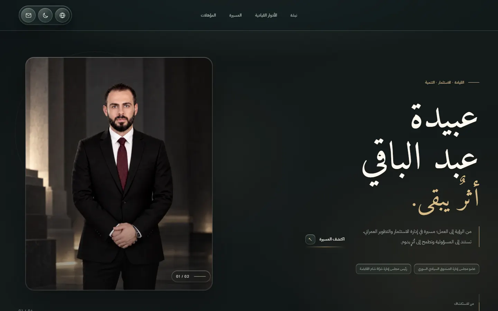
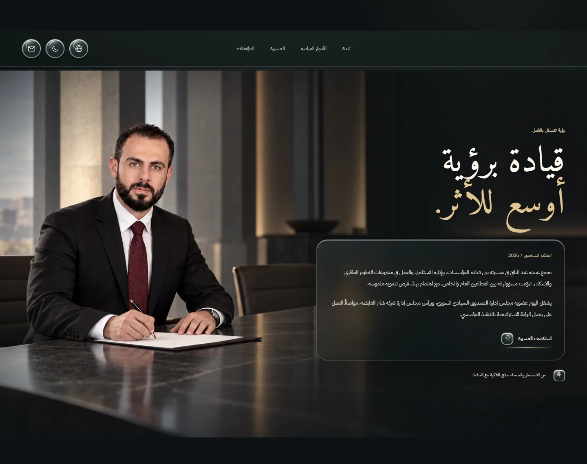
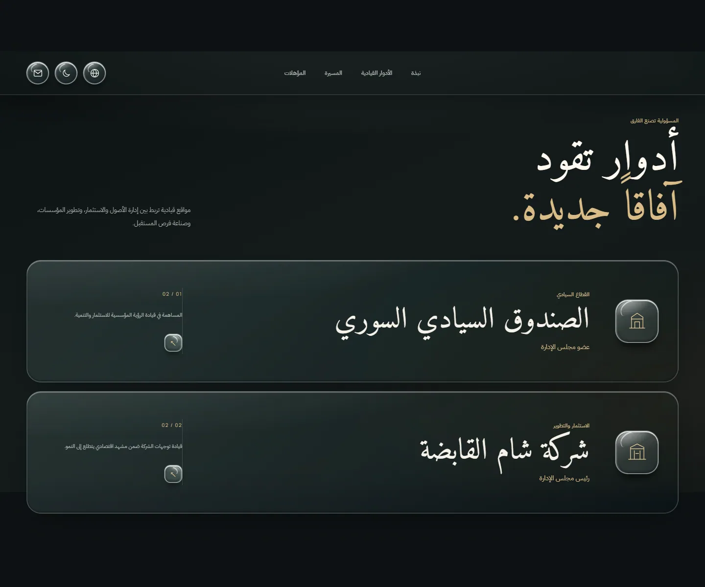
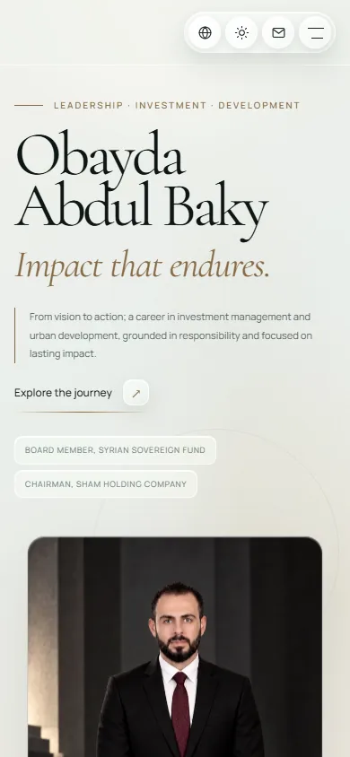

# Obayda Abdul Baky — Personal Website

A bilingual Arabic/English personal website with dark and light themes. It uses plain HTML, CSS, and JavaScript, with no runtime dependencies or build step.

## Preview






## Local preview

Requires Node.js 18 or newer.

```sh
npm run dev
```

Open `http://127.0.0.1:4173`. The site can also be published by serving the repository root as static files.

With Chrome installed, `npm install` followed by `npm run check:visual` checks desktop, tablet, and mobile layouts in both languages and themes. It writes screenshots to the system temporary directory.

## Content and assets

- The professional history, qualifications, email, and phone number are drawn from the supplied three-page CV.
- The Syrian Sovereign Fund board role and Sham Holding chair role were supplied directly by the site owner. The CV does not state the sovereign fund board role.
- The English spelling of the name follows the repository name and email address; it does not appear as a full name in the Arabic CV.
- The hero portrait and the illustrative meeting room signing scene were generated from the supplied reference photo and optimized to responsive WebP files. The original user photo and CV are not committed.
- Frosted glass uses native CSS `backdrop-filter`; no icon or visual effect library is required in the published site.
- Fonts are self-hosted under `assets/fonts`; the corresponding SIL Open Font Licenses are stored there.

Edit the Arabic copy in `index.html` and the English copy in `main.js`. Keep both versions aligned. The language and theme controls save preferences in local storage.
